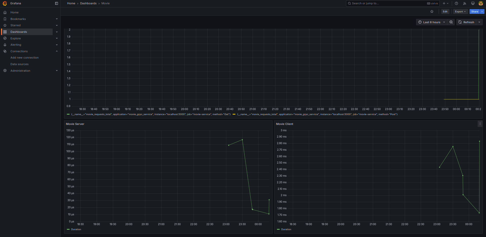

## Movie Axum dan Tonic

## Running Jaeger, Prometheus and Grafana in Docker run

```bash
docker run -d --name jaeger \
  -e COLLECTOR_OTLP_ENABLED=true \
  -p 4317:4317 \  
  -p 6831:6831/udp \  
  -p 6832:6832/udp \  
  -p 16686:16686 \ 
  -p 14268:14268 \  
  jaegertracing/all-in-one:latest

docker run -d --name prometheus \
  --network=host \
  -v $(pwd)/prometheus.yml:/etc/prometheus/prometheus.yml \
  prom/prometheus

docker run -d --name grafana \
  -p 3000:3000 \
  -e GF_SECURITY_ADMIN_PASSWORD=admin \
  --network=host \
  grafana/grafana:latest
```


## Preview Grafana(Jaeger and Prometheus)


## Running Server Grpc
```bash
make run-server
```

## Running Client Axum

```bash
make run-client
```

-------

### 1. List Movies

```bash
curl -X GET http://127.0.0.1:5000/movies
```

### 2. Create Movie

```bash
curl -X POST http://127.0.0.1:5000/movies \
-H "Content-Type: application/json" \
-d '{
  "title": "Inception",
  "genre": "Sci-Fi"
}'
```

### 3. Get Movie by ID

```bash
curl -X GET http://127.0.0.1:5000/movies/1
```

### 4. Update Movie

```bash
curl -X PUT http://127.0.0.1:5000/movies/1 \
-H "Content-Type: application/json" \
-d '{
  "title": "Interstellar",
  "genre": "Adventure"
}'
```

### 5. Delete Movie

```bash
curl -X DELETE http://127.0.0.1:5000/movies/1
```