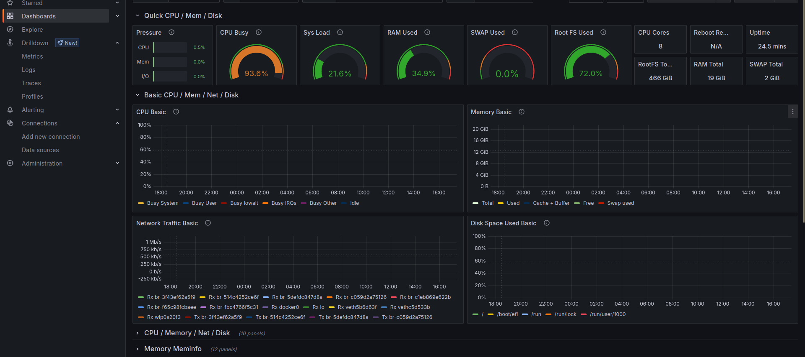

## Movie Axum dan Tonic


## Preview Grafana(Jaeger and Prometheus)

 <br />

 <br />





## Running Server Grpc
```bash
make run-server
```

## Running Client Axum

```bash
make run-client
```

-------

### 1. List Movies

```bash
curl -X GET http://127.0.0.1:5000/movies
```

### 2. Create Movie

```bash
curl -X POST http://127.0.0.1:5000/movies \
-H "Content-Type: application/json" \
-d '{
  "title": "Inception",
  "genre": "Sci-Fi"
}'
```

### 3. Get Movie by ID

```bash
curl -X GET http://127.0.0.1:5000/movies/1
```

### 4. Update Movie

```bash
curl -X PUT http://127.0.0.1:5000/movies/1 \
-H "Content-Type: application/json" \
-d '{
  "title": "Interstellar",
  "genre": "Adventure"
}'
```

### 5. Delete Movie

```bash
curl -X DELETE http://127.0.0.1:5000/movies/1
```